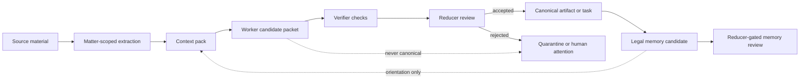
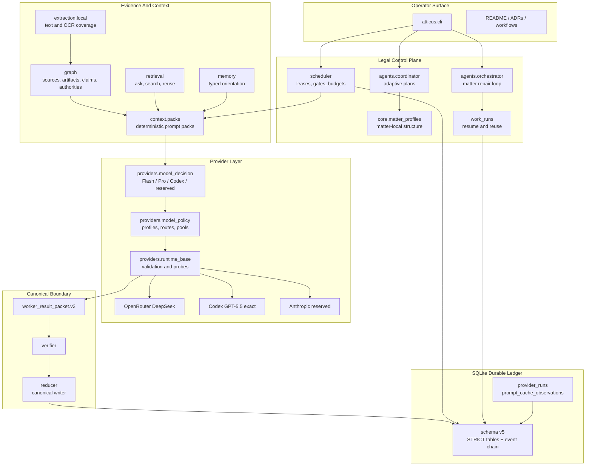
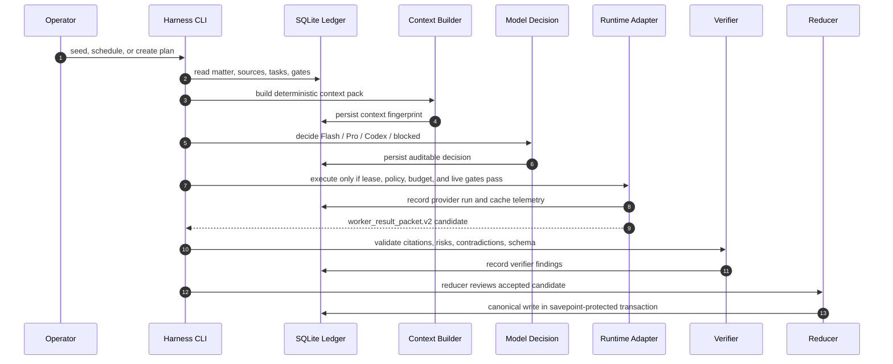
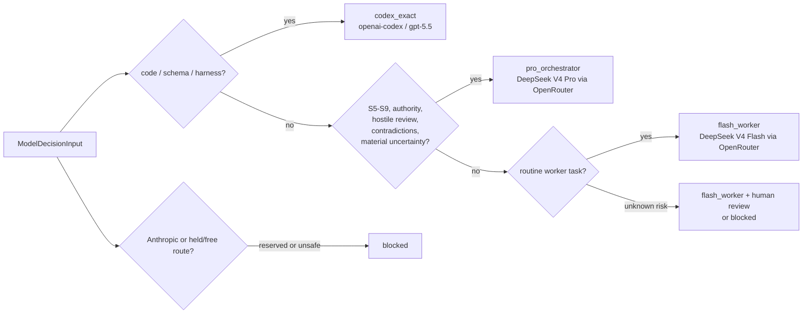
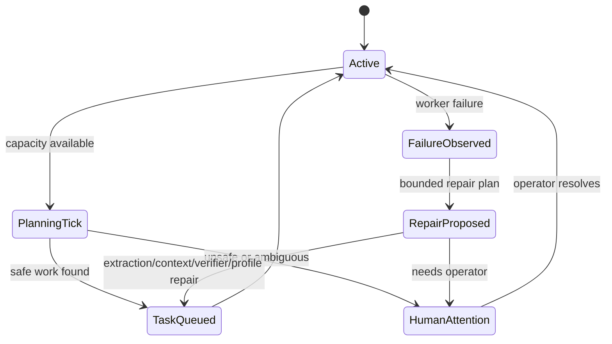
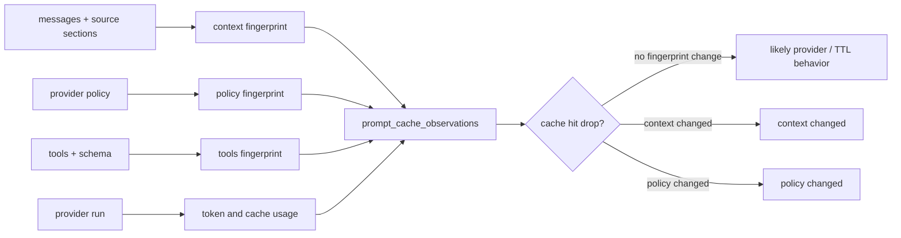
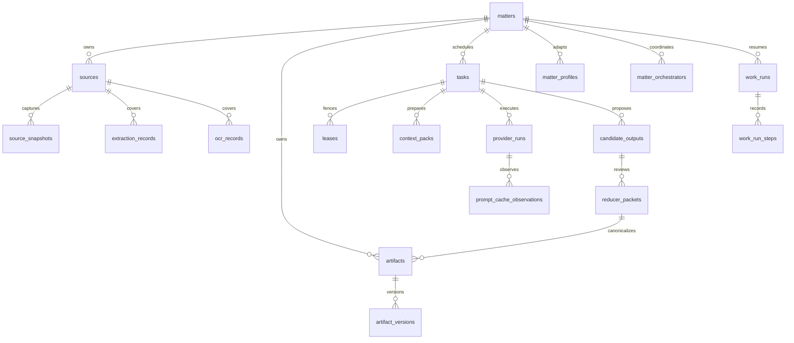

<div align="center">

# Atticus Harness

### Evidence-first legal AI control plane for matter-scoped work, safe model routing, resumable case operations, and reducer-gated legal outputs.

[](#development-and-verification)
[](#durable-data-model)
[](#smart-model-routing)
[](#safety-doctrine)
[](#cache-and-context-observability)

<sub>
Atticus is not a solicitor, does not perform external legal actions, and treats model output as candidate material until validation plus reducer acceptance.
</sub>

</div>

---

## Table Of Contents

- [What Atticus Is](#what-atticus-is)
- [What It Does](#what-it-does)
- [Safety Doctrine](#safety-doctrine)
- [Architecture At A Glance](#architecture-at-a-glance)
- [Lifecycle: From Source To Canonical Work](#lifecycle-from-source-to-canonical-work)
- [Legal Control Structure](#legal-control-structure)
- [Smart Model Routing](#smart-model-routing)
- [Provider Surfaces](#provider-surfaces)
- [Adaptive Matters And Orchestrators](#adaptive-matters-and-orchestrators)
- [Work Runs And Reuse](#work-runs-and-reuse)
- [Cache And Context Observability](#cache-and-context-observability)
- [Durable Data Model](#durable-data-model)
- [Command Playbook](#command-playbook)
- [Development And Verification](#development-and-verification)

---

## What Atticus Is

Atticus Harness is a standalone legal operations harness. It is the durable
control plane that owns matter state, source snapshots, task orchestration,
context packs, model policy, budgets, leases, candidate packets, reducer review,
legal memory, provider telemetry, and audit events.

OpenClaw, Codex, OpenRouter, Anthropic, Claude Code, and other agents are
adapters at the edge. They can help execute bounded work, but they are not the
source of truth. The harness decides what context is visible, what model is
allowed, whether a task can run, and whether any output may become canonical.

<table>
  <tr>
    <th align="left">Atticus Owns</th>
    <th align="left">Atticus Refuses</th>
  </tr>
  <tr>
    <td>
      Matter-scoped evidence, durable task state, model decisions, context
      fingerprints, candidate packets, reducer records, and legal memory.
    </td>
    <td>
      Silent model fallback, cross-matter context, memory-as-proof, cache-as-proof,
      autonomous external legal action, and worker writes to canonical state.
    </td>
  </tr>
  <tr>
    <td>
      Dry-run-first planning, adaptive matter profiles, per-matter orchestrators,
      resumable work runs, and auditable provider/cache provenance.
    </td>
    <td>
      Hidden retries, unbounded autonomous loops, uncited legal conclusions,
      free-model routing by default, and live Anthropic use by default.
    </td>
  </tr>
</table>

## What It Does

Atticus coordinates legal case-preparation work without letting model output
become trusted merely because it sounds confident.

Core capabilities:

- Imports and snapshots matter-local sources with chain-of-custody metadata.
- Extracts local text and OCR coverage without provider calls.
- Builds deterministic context packs with evidence manifests, source excerpts,
  artifact bundles, memory orientation, validation gates, skills, tools, and
  required output schema.
- Schedules S0-S9 legal stages with dependency, budget, matter, citation,
  stale-input, provider, human-gate, and certification checks.
- Routes models through deterministic policy and smart model decisions.
- Produces strict `worker_result_packet.v2` candidate packets.
- Runs verifier checks such as citation audit and hostile review.
- Reduces accepted candidate material through the reducer-only canonical writer.
- Maintains typed legal memory as orientation, not proof.
- Tracks durable work runs so interrupted work can be resumed and prior work can
  be reused only when it remains matter-local and non-stale.
- Records provider, context, model-policy, cache, and failover provenance.

## Safety Doctrine

The harness is built around a simple rule: a legal AI worker may help discover,
organize, and propose, but it must not quietly become the authority.

Non-negotiable invariants:

- Evidence comes before argument.
- Context must be matter-scoped and inspectable.
- Model output is candidate material until validation and reducer acceptance.
- Workers create candidate packets only.
- Reducers are the only canonical writers.
- Provider/model routing is explicit, deterministic, and fail-closed.
- External legal actions are blocked unless a future safe design and exact
  operator approval explicitly authorize the action.
- Memory is operational orientation, not evidence.
- Cache hits save cost, not legal verification.
- Human gates remain in place for high-risk and final-stage work.



## Architecture At A Glance

Atticus is intentionally split into local control modules. The database and
event stream sit at the center; provider runtimes and agent adapters sit at the
outside.



### Module Map

| Area | Modules | Purpose |
| --- | --- | --- |
| CLI and command registry | `atticus/cli.py`, `atticus/commands/` | Operator entry points, command metadata, read/write/live/dry-run visibility. |
| Durable store | `atticus/db/`, `atticus/core/` | SQLite schema, matters, runs, tasks, policies, event stream, matter profiles. |
| Evidence graph | `atticus/graph/` | Sources, snapshots, artifacts, dependencies, issues, claims, authorities, staleness. |
| Extraction | `atticus/extraction/local.py` | Local text/OCR coverage without live provider calls. |
| Context | `atticus/context/` | Deterministic context pack sections, diagnostics, compression, cache-safe prefixes. |
| Scheduling | `atticus/scheduler/` | Dependency-aware task selection, leases, gates, capacity, supervisor loop. |
| Providers | `atticus/providers/`, `atticus/adapters/` | Policy validation, smart decisioning, OpenRouter, Codex, Anthropic reserved surface. |
| Agents | `atticus/agents/` | Coordinator, orchestrator, subagents, cache-safe context sharing. |
| Reducer | `atticus/reducer/` | Reducer packet review, dissent/council support, canonical writer. |
| Retrieval and memory | `atticus/retrieval/`, `atticus/memory/` | Read-only ask/search, work reuse, typed legal memory extraction and consolidation. |
| Work persistence | `atticus/work_runs.py` | Resume tokens, work step ledger, reuse records, stale invalidation. |

## Lifecycle: From Source To Canonical Work



## Legal Control Structure

Atticus keeps a fixed baseline legal workflow and lets each matter adapt safely
from that baseline.

| Stage | Name | Typical Work | Normal Model Tier |
| --- | --- | --- | --- |
| S0 | Source inventory | File intake, inventory, source triage, extraction gaps | Flash worker |
| S1 | Extraction QA | OCR/text coverage, direct citation checks | Flash worker |
| S2 | Classification | Source classification, duplicate detection, production mapping | Flash worker |
| S3 | Chronology | Direct event extraction where citations are straightforward | Flash worker |
| S4 | Issue mapping | Factual issue grouping and routine scaffolding | Flash worker |
| S5 | Strategy planning | Matter orchestration and synthesis | Pro orchestrator |
| S6 | Authority mapping | Law and authority analysis | Pro orchestrator |
| S7 | Hostile review | Opponent review, contradiction analysis, risk attack | Pro orchestrator |
| S8 | Draft preparation | Draft-influencing analysis and filing-pack preparation | Pro or Codex only where policy explicitly says code |
| S9 | Final quality gate | Final review, citation/risk gate, human review | Pro orchestrator |

Foundation gates prevent downstream work from running before the evidence base is
ready. S6-S9 tasks are blocked unless prerequisites are met or the task is
explicitly a gap-finding or repair task.

## Smart Model Routing

Atticus model selection is deterministic and auditable. The smart decision layer
uses explicit task metadata, risk, stage, contradictions, uncertainty, authority
needs, drafting finality, evidence volume, requested capabilities, and operator
override fields.



Decision tiers:

| Tier | Provider / Model | Used For | Fallback |
| --- | --- | --- | --- |
| `flash_worker` | OpenRouter `deepseek/deepseek-v4-flash` | Source inventory, extraction QA, classification, dedupe, retrieval, routine redaction scan, chronology extraction, candidate formatting. | Disabled unless explicit pool policy says otherwise. |
| `pro_orchestrator` | OpenRouter `deepseek/deepseek-v4-pro` | Orchestration, authority mapping, contradiction analysis, hostile review, high-risk synthesis, final gates, reducer decision support. | Disabled unless explicit pool policy says otherwise. |
| `codex_exact` | `openai-codex` `gpt-5.5` | Code, schema migrations, tests, harness self-improvement, coding agents, exact Codex routes. | Never. |
| `anthropic_reserved` | Anthropic Opus/Sonnet aliases | Future reserved option only. | Never. |
| `blocked` | None | Missing data, disabled profile, held/free model, unsafe route, unknown provider. | Never. |

Validate and smoke-test the current smart default:

```bash
python -m atticus.cli model-policy validate \
  --policy-file tests/fixtures/model_policies/deepseek_smart_default.json

python -m atticus.cli model-policy resolve \
  --policy-file tests/fixtures/model_policies/deepseek_smart_default.json \
  --stage S0 \
  --layer worker \
  --task-type source_inventory

python -m atticus.cli model-policy resolve \
  --policy-file tests/fixtures/model_policies/deepseek_smart_default.json \
  --stage S7 \
  --layer hostile_review \
  --task-type hostile_opponent_review

python -m atticus.cli model-policy decide \
  --policy-file tests/fixtures/model_policies/deepseek_smart_default.json \
  --stage S7 \
  --layer hostile_review \
  --task-type hostile_opponent_review
```

Set smart defaults on queued tasks for one matter:

```bash
python -m atticus.cli set-provider-policy \
  --db data/atticus.sqlite3 \
  --matter MATTER \
  --smart-defaults \
  --write
```

## Provider Surfaces

### OpenRouter DeepSeek

DeepSeek V4 Flash and Pro are active OpenRouter models. OpenRouter failover can
be enabled only through explicit policy or environment configuration. There is
no hidden fallback to free models, local stubs, Codex, or Anthropic.

```bash
ATTICUS_OPENROUTER_FAILOVER_ENABLED=1 \
ATTICUS_OPENROUTER_FAILOVER_MODELS="deepseek/deepseek-v4-flash,deepseek/deepseek-v4-pro" \
python -m atticus.cli live-resume --db data/atticus.sqlite3 --probe --write-leases
```

### Held OpenRouter Free Bundle

OpenRouter free models are held inventory. They are not normal routes.

- Non-live development parsing requires `ATTICUS_ENABLE_HELD_OPENROUTER_MODELS=1`.
- Live legal work also requires `ATTICUS_ALLOW_HELD_MODELS_FOR_LIVE=1`.
- Without the required flags, held/free models are unknown and fail closed.

### Codex GPT-5.5

Codex is exact. The harness accepts Codex only through the exact
`openai-codex/gpt-5.5` route and does not allow fallback.

Live Codex execution requires all of:

- exact Codex GPT-5.5 policy
- fallback disabled
- active lease and matching worker ID
- `--allow-live`
- `ATTICUS_ENABLE_LIVE_CODEX=1`
- bounded timeout
- explicit reasoning effort
- strict JSON candidate packet output
- current operator approval for live spend

Bounded one-tick pattern after approval:

```bash
ATTICUS_ENABLE_LIVE_CODEX=1 python -m atticus.cli run-free-loop \
  --db data/napier-accommodation-arrears.sqlite \
  --output-dir matters/napier-accommodation-arrears/05-candidates \
  --capacity 1 \
  --max-ticks 1 \
  --runtime codex \
  --allow-live \
  --codex-timeout-seconds 180 \
  --codex-reasoning-effort low
```

### Anthropic Reserved Surface

Anthropic profiles may exist as reserved policy entries, but smart defaults do
not select them. Live Anthropic execution is disabled by default and requires:

- `ATTICUS_ENABLE_LIVE_ANTHROPIC=1`
- a concrete model ID via `ATTICUS_ANTHROPIC_OPUS_MODEL` or
  `ATTICUS_ANTHROPIC_SONNET_MODEL`
- either `ATTICUS_ANTHROPIC_API_KEY` or `ATTICUS_ANTHROPIC_OAUTH_TOKEN`

OAuth tokens are never logged. Raw provider errors are redacted.

## Adaptive Matters And Orchestrators

Matter profiles let Atticus adapt the baseline S0-S9 structure per case without
changing global defaults. Adaptations are versioned, fingerprinted, matter-local,
and reversible.

Guardrails:

- Adaptation cannot disable evidence, citation, reducer, or canonical-write gates.
- Adaptation cannot enable external actions.
- Adaptation cannot route high-risk legal work to held/free models.
- Adaptation cannot remove human review from S8/S9.
- Reset affects only the selected matter.

```bash
python -m atticus.cli matter-profile show \
  --db data/atticus.sqlite3 \
  --matter MATTER \
  --json

python -m atticus.cli matter-profile propose \
  --db data/atticus.sqlite3 \
  --matter MATTER \
  --goal "Inventory priority sources" \
  --json

python -m atticus.cli matter-profile apply \
  --db data/atticus.sqlite3 \
  --matter MATTER \
  --profile-file proposed-profile.json \
  --write

python -m atticus.cli matter-profile reset \
  --db data/atticus.sqlite3 \
  --matter MATTER \
  --write
```

Per-matter orchestrators keep case work independent and repair-focused. When a
worker fails, the orchestrator records matter-scoped human attention, emits an
event, and proposes bounded repair such as missing extraction, context rebuild,
Pro review, profile adaptation, verifier task, or human intervention. It must
not silently retry forever.

```bash
python -m atticus.cli orchestrator status \
  --db data/atticus.sqlite3 \
  --matter MATTER \
  --json

python -m atticus.cli orchestrator tick \
  --db data/atticus.sqlite3 \
  --matter MATTER \
  --capacity 5

python -m atticus.cli orchestrator failures \
  --db data/atticus.sqlite3 \
  --matter MATTER \
  --json
```



## Work Runs And Reuse

Work runs make Atticus resumable. A work run records the goal, active profile,
steps, context packs, provider runs, candidates, artifacts, reuse decisions, and
stale invalidation.

Reusable work must be:

- from the same matter
- non-stale
- tied to current source snapshots
- accepted/reduced where trust is required
- rebuildable from source chunks or context fingerprints
- treated as orientation unless it is canonical evidence or reducer-accepted

```bash
python -m atticus.cli work-run start \
  --db data/atticus.sqlite3 \
  --matter MATTER \
  --goal "Inventory priority sources" \
  --write

python -m atticus.cli work-run status \
  --db data/atticus.sqlite3 \
  --matter MATTER \
  --json

python -m atticus.cli work-run resume \
  --db data/atticus.sqlite3 \
  --matter MATTER \
  --resume-token RESUME_TOKEN \
  --json

python -m atticus.cli work-run reusable \
  --db data/atticus.sqlite3 \
  --matter MATTER \
  --goal "Follow up on the accommodation arrears evidence" \
  --json
```

## Cache And Context Observability

Atticus fingerprints the material facts of provider work:

- context pack ID and context fingerprint
- provider policy fingerprint
- configured model list
- failover events
- prompt cache hit/write/miss tokens
- cache telemetry source
- prompt-cache observations with system, tools, context, and policy fingerprints

Cache diagnostics are cost and performance telemetry. They are not evidence of
legal correctness.



## Durable Data Model

The current schema is version 5. SQLite is the current durable store, with STRICT
tables, foreign keys, WAL mode, append-only events, mutable projections, and
fingerprinted records that can later be migrated to a larger store without
changing the legal operating model.



Important table families:

| Family | Tables |
| --- | --- |
| Matters and profiles | `matters`, `matter_profiles`, `matter_profile_stages`, `matter_profile_changes` |
| Evidence graph | `sources`, `source_snapshots`, `artifacts`, `artifact_versions`, `artifact_sources`, `artifact_dependencies` |
| Legal structure | `issues`, `claims`, `chronology_events`, `legal_authorities`, `citation_spans`, `validations`, `certifications` |
| Execution | `tasks`, `leases`, `context_packs`, `provider_runs`, `candidate_outputs`, `reducer_packets` |
| Orchestration | `matter_orchestrators`, `orchestrator_events`, `work_runs`, `work_run_steps`, `work_reuse_records` |
| Memory and retrieval | `legal_memory`, search index/projection tables, work reuse records |
| Observability | `events`, `human_attention`, `prompt_cache_observations`, provider telemetry columns |

## Command Playbook

### Initialize And Inspect

```bash
python -m atticus.cli init --db data/atticus.sqlite3
python -m atticus.cli doctor --db data/atticus.sqlite3
python -m atticus.cli status --db data/atticus.sqlite3
python -m atticus.cli commands list --json
python -m atticus.cli command show run-free-loop --json
```

### Seed A Matter

```bash
python -m atticus.cli seed-matter \
  --db data/napier-accommodation-arrears.sqlite \
  --matter napier-accommodation-arrears \
  --workspace matters/napier-accommodation-arrears \
  --inventory matters/napier-accommodation-arrears/02-registers/file_inventory.csv \
  --provider openrouter \
  --model deepseek/deepseek-v4-flash \
  --no-fallback
```

Add `--write` only after reviewing the dry-run JSON. The seeder does not read
credentials, call providers, create leases, create provider runs, or perform
external actions.

### Extract Local Text And OCR

```bash
python -m atticus.cli extract-sources \
  --db data/napier-accommodation-arrears.sqlite \
  --matter napier-accommodation-arrears \
  --workspace matters/napier-accommodation-arrears

python -m atticus.cli extract-sources \
  --db data/napier-accommodation-arrears.sqlite \
  --matter napier-accommodation-arrears \
  --workspace matters/napier-accommodation-arrears \
  --source-id NAP-SRC-0051 \
  --source-id NAP-SRC-0052 \
  --write
```

Supported local paths include DOCX, legacy DOC through local conversion tools,
PDF through `pdftotext`, text/HTML files, and images through existing OCR text
or local `tesseract`.

### Schedule And Build Context

```bash
python -m atticus.cli schedule \
  --db data/atticus.sqlite3 \
  --capacity 5 \
  --dry-run

python -m atticus.cli work-order \
  --db data/atticus.sqlite3 \
  --task-id TASK_ID \
  --dry-run

python -m atticus.cli context \
  --db data/atticus.sqlite3 \
  --task-id TASK_ID \
  --json
```

If `source_materials` is empty for a source-dependent task, run local extraction
first and re-check extraction coverage.

### Plan Legal Work

```bash
python -m atticus.cli coordinator plan \
  --db data/atticus.sqlite3 \
  --matter MATTER \
  --goal "Draft a cited complaint about accommodation arrears handling"

python -m atticus.cli coordinator create-tasks \
  --db data/atticus.sqlite3 \
  --matter MATTER \
  --goal "Draft a cited complaint about accommodation arrears handling" \
  --write
```

Coordinator write mode creates queued tasks only. It creates no leases, provider
runs, candidate outputs, canonical artifacts, or external actions.

### Validate, Verify, Reduce

```bash
python -m atticus.cli inspect \
  --db data/atticus.sqlite3 \
  --type candidate \
  --id CANDIDATE_ID

python -m atticus.cli verifier run \
  --db data/atticus.sqlite3 \
  --candidate-id CANDIDATE_ID \
  --type citation_audit \
  --json

python -m atticus.cli lease \
  --db data/atticus.sqlite3 \
  --task-id TASK_ID \
  --worker-id atticus-reducer-manual \
  --write

python -m atticus.cli reduce \
  --db data/atticus.sqlite3 \
  --candidate-id CANDIDATE_ID \
  --lease-id LEASE_ID \
  --dry-run
```

Use `--write` on reduction only after reviewing the dry-run. Reducer acceptance
is savepoint-protected around canonical artifact writing, reducer packet
recording, candidate status changes, lease completion, and proposed-task import.

### Legal Memory

```bash
python -m atticus.cli memory list --db data/atticus.sqlite3 --matter MATTER
python -m atticus.cli memory show MEMORY_ID --db data/atticus.sqlite3 --matter MATTER
python -m atticus.cli memory export-index --db data/atticus.sqlite3 --matter MATTER

python -m atticus.cli memory extract-candidates \
  --db data/atticus.sqlite3 \
  --matter MATTER \
  --candidate-id REDUCED_ACCEPTED_CANDIDATE_ID

python -m atticus.cli memory consolidate \
  --db data/atticus.sqlite3 \
  --matter MATTER
```

Memory extraction only works from a `reduced` candidate with an accepted reducer
packet. Write mode creates `status='candidate'` memories only.

### Sessions

```bash
python -m atticus.cli session list --db data/atticus.sqlite3 --matter MATTER
python -m atticus.cli session show SESSION_ID --db data/atticus.sqlite3
python -m atticus.cli session resume SESSION_ID --db data/atticus.sqlite3
python -m atticus.cli session export SESSION_ID --db data/atticus.sqlite3
```

Sessions persist sensitive matter-scoped transcripts without replaying provider
calls.

## Development And Verification

Run the full local verification set:

```bash
python -m pytest -q
python -m compileall -q atticus tests
git diff --check
git diff --cached --check
```

Model-policy smoke checks:

```bash
python -m atticus.cli model-policy validate \
  --policy-file tests/fixtures/model_policies/deepseek_smart_default.json

python -m atticus.cli model-policy resolve \
  --policy-file tests/fixtures/model_policies/deepseek_smart_default.json \
  --stage S0 \
  --layer worker \
  --task-type source_inventory

python -m atticus.cli model-policy resolve \
  --policy-file tests/fixtures/model_policies/deepseek_smart_default.json \
  --stage S7 \
  --layer hostile_review \
  --task-type hostile_opponent_review
```

Optional static check when `basedpyright` is available:

```bash
basedpyright atticus tests --outputjson > /tmp/atticus-basedpyright.json
python - <<'PY'
import json

data = json.load(open("/tmp/atticus-basedpyright.json"))
summary = data.get("summary", {})
print(summary)
raise SystemExit(0 if summary.get("errorCount", 0) == 0 else 1)
PY
```

Check that no live provider or OpenClaw work is running:

```bash
ps -eo pid,ppid,stat,etime,cmd | grep -Ei '[c]odex exec|[a]tticus|[o]penclaw.*atticus' || true
```

Tests do not hit live provider APIs and do not start OpenClaw.

## Project Design Notes

Architecture decision records live in [`docs/architecture`](docs/architecture):

- ADR 001: standalone harness
- ADR 002: OpenClaw as adapter
- ADR 003: legal evidence graph
- ADR 004: read-only query versus active work
- ADR 005: provider policy and budgeting
- ADR 006: worker-reducer councils
- ADR 007: context pack memory
- ADR 008: legal control plane v2

The short version: Atticus is a harness first and an AI wrapper second. Its job
is to make legal AI work inspectable, resumable, reversible, citation-bound,
matter-local, and boringly safe where it matters.
