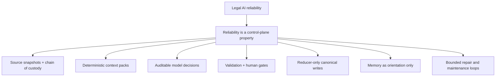
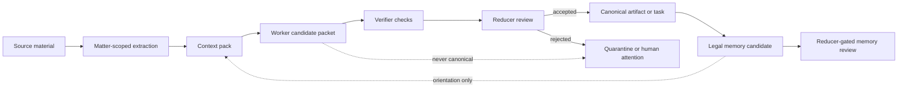
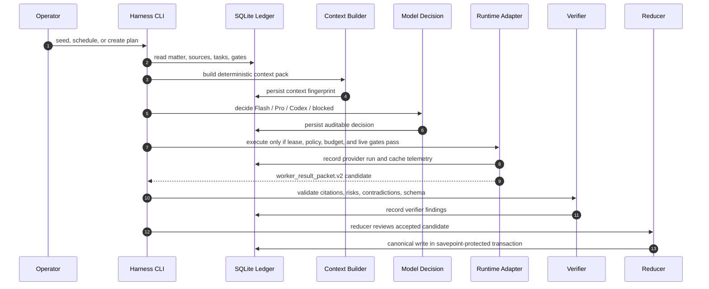
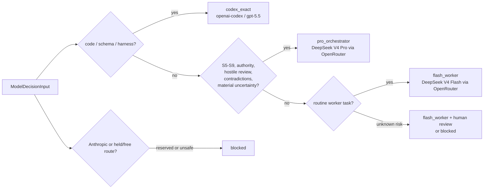
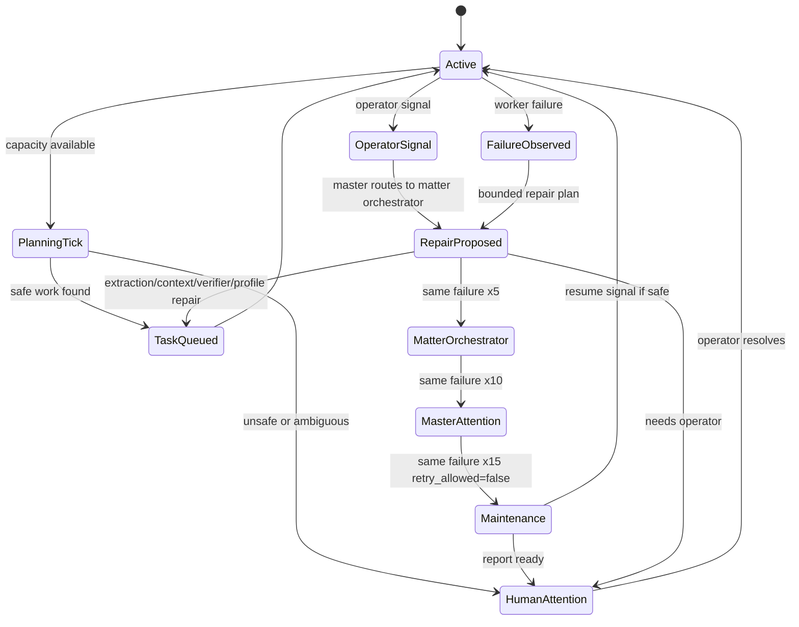
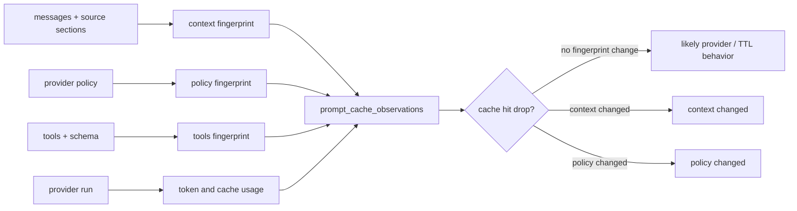
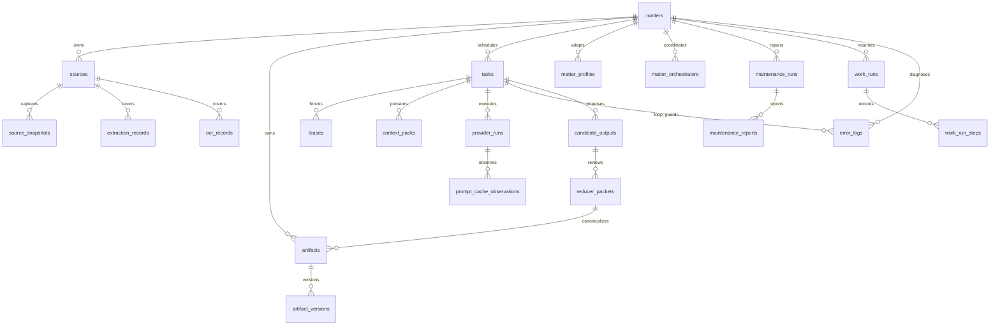

<div align="center">

# Atticus Harness

### Evidence-first legal AI control plane for matter-scoped work, safe model routing, resumable case operations, and reducer-gated legal outputs.

[](#development-and-verification)
[](#durable-data-model)
[](#smart-model-routing)
[](#safety-doctrine)
[](#cache-and-context-observability)

<sub>
Atticus is not a solicitor, does not perform external legal actions, and treats model output as candidate material until validation plus reducer acceptance.
</sub>

</div>

---

## Table Of Contents

- [Abstract](#abstract)
- [Human Installation](#human-installation)
- [AI Agent Installation And Handoff](#ai-agent-installation-and-handoff)
- [What Atticus Is](#what-atticus-is)
- [What It Does](#what-it-does)
- [Safety Doctrine](#safety-doctrine)
- [System Research Thesis](#system-research-thesis)
- [Architecture At A Glance](#architecture-at-a-glance)
- [Lifecycle: From Source To Canonical Work](#lifecycle-from-source-to-canonical-work)
- [Legal Control Structure](#legal-control-structure)
- [Smart Model Routing](#smart-model-routing)
- [Provider Surfaces](#provider-surfaces)
- [Adaptive Matters And Orchestrators](#adaptive-matters-and-orchestrators)
- [Work Runs And Reuse](#work-runs-and-reuse)
- [Cache And Context Observability](#cache-and-context-observability)
- [Durable Data Model](#durable-data-model)
- [Command Playbook](#command-playbook)
- [Operator Runbooks](#operator-runbooks)
- [Troubleshooting And Known Weaknesses](#troubleshooting-and-known-weaknesses)
- [Development And Verification](#development-and-verification)
- [Project Design Notes](#project-design-notes)
- [Glossary](#glossary)

---

## Abstract

Atticus Harness is an evidence-first legal AI control plane. It is built for a
hard problem: allowing autonomous or semi-autonomous agents to assist with legal
case preparation while preserving matter isolation, source provenance, human
gates, strict model routing, and reducer-only canonical writes.

The central research claim is that legal AI reliability should not be delegated
to a model's apparent confidence. Reliability must be produced by a control
system: durable source snapshots, deterministic context packs, explicit model
selection, validation gates, quote/hash support checks, loop guards, maintenance
orchestration, reducer acceptance, and auditable work reuse.

Atticus therefore treats every model response as a candidate packet. A candidate
can help, but it cannot become canonical merely by existing. It must cite
allowed proof targets, survive validation, pass reducer review, and remain tied
to current matter-local evidence.

> Atticus is an operating system for legal evidence work, not a chatbot wrapper.

Primary contributions:

- A matter-scoped SQLite ledger for sources, snapshots, tasks, candidates,
  provider runs, cache observations, validations, certifications, and work runs.
- A safety doctrine where memory, cache hits, OCR text, and drafts are never
  silently promoted into proof.
- A deterministic smart model decision layer: DeepSeek Flash for routine work,
  DeepSeek Pro for high-risk reasoning, Codex GPT-5.5 exact for code, Anthropic
  reserved by default, and OpenRouter free models held.
- A bounded orchestration loop with failure escalation, maintenance diagnostics,
  and terminal user-intervention states instead of infinite retry churn.
- A resumable case-work model that can reuse prior work only when it remains
  current, same-matter, and properly reduced or certified.



---

## Human Installation

These commands install Atticus for a human operator from a fresh checkout.

### 1. Clone And Enter The Repository

```bash
git clone https://github.com/Albaloola/atticus-harness.git
cd atticus-harness
```

### 2. Create A Python Environment

Atticus requires Python 3.11 or newer.

```bash
python --version
python -m venv .venv
source .venv/bin/activate
python -m pip install --upgrade pip
python -m pip install -e ".[dev]"
```

### 3. Install Optional Local Extraction Tools

Atticus can run without live providers, but local extraction quality improves
when the host has PDF, OCR, and document-conversion tools.

Ubuntu/Debian:

```bash
sudo apt-get update
sudo apt-get install -y sqlite3 poppler-utils tesseract-ocr libreoffice pandoc
```

Arch Linux:

```bash
sudo pacman -S --needed sqlite poppler tesseract tesseract-data-eng libreoffice-fresh pandoc
```

What these tools do:

| Tool | Used For | Harness Behavior If Missing |
| --- | --- | --- |
| `sqlite3` | Manual DB inspection and operator diagnostics | Python SQLite still works; shell DB inspection is less convenient. |
| `pdftotext` | Local PDF extraction | PDF extraction reports unavailable coverage until fixed. |
| `tesseract` | Local image OCR | Image OCR records are not produced. |
| `libreoffice` / `soffice` | Legacy Office conversion | Legacy `.doc` and unusual Office files may need manual conversion. |
| `pandoc` | Secondary document conversion fallback | Some text conversion paths are unavailable. |

### 4. Verify The Install

```bash
python -m atticus.cli --help
python -m atticus.cli commands list --json
python -m pytest -q
python -m compileall -q atticus tests
git diff --check
```

Expected baseline after a clean checkout: tests pass, compileall is quiet, and
`git diff --check` prints no whitespace errors.

### 5. Create A New Harness Database

```bash
mkdir -p data matters
python -m atticus.cli init --db data/atticus.sqlite3
python -m atticus.cli doctor --db data/atticus.sqlite3 --schema --json
```

`doctor` should report schema version 6 with no missing required tables,
columns, or indexes.

### 6. Configure Live Providers Only When Needed

Local planning, extraction, validation, and reduction do not require provider
secrets. Live OpenRouter work requires both an API key and an explicit harness
enable flag:

```bash
export OPENROUTER_API_KEY="sk-or-..."
export ATTICUS_ENABLE_LIVE_OPENROUTER=1
```

Do not commit, paste, or upload API keys. Keep them in the shell environment or
a local secret manager outside the repository.

Codex live execution:

```bash
export ATTICUS_ENABLE_LIVE_CODEX=1
```

Anthropic is reserved by default. Do not enable it unless deliberately testing a
future provider surface:

```bash
export ATTICUS_ENABLE_LIVE_ANTHROPIC=1
export ATTICUS_ANTHROPIC_OPUS_MODEL="concrete-provider-model-id"
export ATTICUS_ANTHROPIC_API_KEY="..."
```

---

## AI Agent Installation And Handoff

This section is written for Codex, OpenClaw, Claude Code, or any future coding
agent asked to operate Atticus.

### Agent Prime Directive

1. Read this README and the ADRs under `docs/architecture/` before changing the
   system.
2. Treat `/home/alba/atticus-harness` as the source tree and the SQLite DBs
   under `data/` as sensitive matter ledgers.
3. Never commit or upload API keys, OAuth tokens, local `.env` files, private
   provider transcripts, or raw private case evidence unless the repository is
   explicitly designed to hold that exact artifact.
4. Prefer dry-run commands first. Use `--write` only when the command is meant
   to mutate the ledger and the mutation is safe.
5. Never weaken reducer-only canonical writes, matter isolation, citation
   validation, human gates, no-silent-fallback policy, or loop guards.
6. If a loop blocks, do not just rerun it. Inspect `error_logs`, open
   `human_attention`, `orchestrator_events`, `leases`, task blocked reasons,
   and provider runs.
7. If a model output is malformed, repair the prompt or task contract rather
   than training the harness to accept sloppy packets.

### Agent Bootstrap

```bash
cd /home/alba/atticus-harness
python -m atticus.cli --help
python -m atticus.cli doctor --db data/napier-accommodation-arrears.sqlite --schema --json
python -m atticus.cli status --db data/napier-accommodation-arrears.sqlite --matter napier-accommodation-arrears
python -m atticus.cli schedule --db data/napier-accommodation-arrears.sqlite --matter napier-accommodation-arrears --capacity 15 --dry-run
```

If the DB is stale or partially migrated:

```bash
python -m atticus.cli doctor \
  --db data/napier-accommodation-arrears.sqlite \
  --schema \
  --repair \
  --write \
  --json
```

### Safe Agent Live-Run Pattern

Use one bounded supervisor tick first, then inspect the ledger:

```bash
ATTICUS_ENABLE_LIVE_OPENROUTER=1 python -m atticus.cli run-free-loop \
  --db data/napier-accommodation-arrears.sqlite \
  --matter napier-accommodation-arrears \
  --output-dir matters/napier-accommodation-arrears/05-candidates \
  --capacity 15 \
  --max-ticks 1 \
  --runtime openrouter \
  --allow-live

python -m atticus.cli status \
  --db data/napier-accommodation-arrears.sqlite \
  --matter napier-accommodation-arrears
```

Do not force all 15 slots. The capacity is a ceiling. Dependency gates, model
preflight, matter profile stage filtering, active leases, budgets, and human
review gates should naturally under-fill capacity when work is sequential.

### Agent Handoff Prompt

Use this prompt when handing the project to another AI agent:

```text
You are operating Atticus Harness in /home/alba/atticus-harness.
Read README.md and docs/architecture before editing. Preserve the evidence-first
doctrine: matter isolation, reducer-only canonical writes, citation target and
quote support validation, no silent model fallback, no autonomous external legal
actions, and no memory/cache-as-proof.

Start with:
python -m atticus.cli doctor --db <DB> --schema --json
python -m atticus.cli status --db <DB> --matter <MATTER>
python -m atticus.cli schedule --db <DB> --matter <MATTER> --capacity 15 --dry-run

If blocked, inspect error_logs, human_attention, orchestrator_events, leases,
provider_runs, validation_results, and task blocked_reasons_json. Fix root
causes in code/tests when the harness is brittle; do not hide failures by
loosening gates.
```

---

## What Atticus Is

Atticus Harness is a standalone legal operations harness. It is the durable
control plane that owns matter state, source snapshots, task orchestration,
context packs, model policy, budgets, leases, candidate packets, reducer review,
legal memory, provider telemetry, and audit events.

OpenClaw, Codex, OpenRouter, Anthropic, Claude Code, and other agents are
adapters at the edge. They can help execute bounded work, but they are not the
source of truth. The harness decides what context is visible, what model is
allowed, whether a task can run, and whether any output may become canonical.

<table>
  <tr>
    <th align="left">Atticus Owns</th>
    <th align="left">Atticus Refuses</th>
  </tr>
  <tr>
    <td>
      Matter-scoped evidence, durable task state, model decisions, context
      fingerprints, candidate packets, reducer records, and legal memory.
    </td>
    <td>
      Silent model fallback, cross-matter context, memory-as-proof, cache-as-proof,
      autonomous external legal action, and worker writes to canonical state.
    </td>
  </tr>
  <tr>
    <td>
      Dry-run-first planning, adaptive matter profiles, per-matter orchestrators,
      resumable work runs, and auditable provider/cache provenance.
    </td>
    <td>
      Hidden retries, unbounded autonomous loops, uncited legal conclusions,
      free-model routing by default, and live Anthropic use by default.
    </td>
  </tr>
</table>

## What It Does

Atticus coordinates legal case-preparation work without letting model output
become trusted merely because it sounds confident.

Core capabilities:

- Imports and snapshots matter-local sources with chain-of-custody metadata.
- Extracts local text and OCR coverage without provider calls, retaining source,
  tool, method, output, hash, and extraction/OCR provenance for citations.
- Plans candidate evidence bundle organization, display names, and ordering
  without silently renaming source files or weakening chain of custody.
- Builds deterministic context packs with evidence manifests, source excerpts,
  artifact bundles, memory orientation, validation gates, skills, tools, and
  required output schema.
- Schedules S0-S9 legal stages with dependency, budget, matter, citation,
  stale-input, provider, human-gate, and certification checks.
- Routes models through deterministic policy and smart model decisions.
- Produces strict `worker_result_packet.v2` candidate packets.
- Runs verifier checks such as citation audit and hostile review.
- Reduces accepted candidate material through the reducer-only canonical writer.
- Maintains typed legal memory as orientation, not proof.
- Tracks durable work runs so interrupted work can be resumed and prior work can
  be reused only when it remains matter-local and non-stale.
- Records provider, context, model-policy, cache, and failover provenance.

## Safety Doctrine

The harness is built around a simple rule: a legal AI worker may help discover,
organize, and propose, but it must not quietly become the authority.

Non-negotiable invariants:

- Evidence comes before argument.
- Context must be matter-scoped and inspectable.
- Model output is candidate material until validation and reducer acceptance.
- Workers create candidate packets only.
- Reducers are the only canonical writers.
- Provider/model routing is explicit, deterministic, and fail-closed.
- External legal actions are blocked unless a future safe design and exact
  operator approval explicitly authorize the action.
- Memory is operational orientation, not evidence.
- Cache hits save cost, not legal verification.
- Human gates remain in place for high-risk and final-stage work.



## System Research Thesis

Atticus uses a control-plane architecture rather than a single-agent autonomy
architecture. The difference is not cosmetic:

- A single-agent system tends to ask "What should the model do next?"
- Atticus asks "What legally safe state transition is currently allowed?"

That framing changes the design. Every step is a transition over a durable
matter ledger. The transition is permitted only if its evidence dependencies,
model policy, budget, lease, citation target rules, quote-support rules, human
gates, and write authority all pass.

### Scientific Model

| Layer | Research Question | Atticus Mechanism | Failure Mode It Prevents |
| --- | --- | --- | --- |
| Evidence | What was actually provided? | `sources`, `source_snapshots`, hashes, custody metadata | Losing chain of custody or citing generated text as source evidence. |
| Readability | How can models read messy files? | `extraction_records`, `ocr_records`, source-material derivatives | Treating OCR as a new primary source. |
| Context | What did the worker see? | `context_packs`, section fingerprints, token budgets | Invisible prompt drift and stale context reuse. |
| Model policy | Why this model? | `ModelDecisionInput`, `ModelDecision`, policy fingerprints | Silent downgrade, unlogged override, or free-model routing. |
| Execution | Who ran what? | leases, provider runs, worker attempts, failover telemetry | Duplicate workers, lost errors, provider failures blamed on tasks. |
| Validation | Is the packet structurally safe? | result schema, citation target integrity, stale dependency gates | Well-formed but uncited or cross-matter outputs. |
| Support | Does quoted text exist? | `citation_support_integrity`, quote/hash checks | Real source ID cited for a quote that is not in the source text. |
| Canonicality | What becomes durable legal work? | reducer-only canonical writer | Workers mutating canonical state directly. |
| Recovery | What happens when blocked? | orchestrator events, loop guard, maintenance lane | Infinite retries and silent stalls. |
| Reuse | Can old work be trusted again? | work runs, reuse decisions, stale invalidation | Stale prior work answering a fresh question. |

### Threat Model

Atticus assumes that these things can and will go wrong:

- A model may cite the wrong source, invent a quote, overstate a legal rule, or
  propose an unsafe external action.
- OCR may be partial, noisy, or attached to the wrong source unless tracked.
- Provider APIs may fail, time out, return malformed JSON, or report versioned
  model IDs that need careful interpretation.
- Operators and agents may resume a newer codebase against an older SQLite DB.
- A blocked gate may otherwise leave the system idle with no repair path.
- A follow-up question may accidentally reuse stale or candidate-only work.
- A large matter may tempt the system to stuff every document into one prompt,
  hiding late-document clauses and wasting cache.

The harness design therefore favors explicit state, small bounded tasks,
matter-local context, deterministic routes, and visible failure over hidden
progress.

### Evidence Flow Texture

```mermaid
flowchart LR
    Raw["Raw source file<br/>hash + custody"] --> Snapshot["Source snapshot"]
    Snapshot --> Derivative["Extracted/OCR derivative<br/>readable view"]
    Derivative --> Context["Context source_materials<br/>cite source ID"]
    Context --> Candidate["worker_result_packet.v2"]
    Candidate --> TargetGate["citation_target_integrity"]
    Candidate --> SupportGate["citation_support_integrity"]
    TargetGate --> Reducer["Reducer"]
    SupportGate --> Reducer
    Reducer --> Canonical["Canonical artifact<br/>source graph links"]
    Canonical --> Reuse["Reusable only while current"]

    Derivative -. "orientation by default" .-> Context
    Derivative -. "not primary proof" .-> Candidate
```



## Architecture At A Glance

Atticus is intentionally split into local control modules. The database and
event stream sit at the center; provider runtimes and agent adapters sit at the
outside.

```mermaid
flowchart TB
    subgraph Operator["Operator Surface"]
        CLI["atticus.cli"]
        Docs["README / ADRs / workflows"]
    end

    subgraph Control["Legal Control Plane"]
        Scheduler["scheduler<br/>leases, gates, budgets"]
        Coordinator["agents.coordinator<br/>adaptive plans"]
        Orchestrator["agents.orchestrator<br/>matter repair loop"]
        Profiles["core.matter_profiles<br/>matter-local structure"]
        WorkRuns["work_runs<br/>resume and reuse"]
    end

    subgraph Evidence["Evidence And Context"]
        Graph["graph<br/>sources, artifacts, claims, authorities"]
        Extraction["extraction.local<br/>text and OCR coverage"]
        Context["context.packs<br/>deterministic prompt packs"]
        Retrieval["retrieval<br/>ask, search, reuse"]
        Memory["memory<br/>typed orientation"]
    end

    subgraph Models["Provider Layer"]
        Decision["providers.model_decision<br/>Flash / Pro / Codex / reserved"]
        Policy["providers.model_policy<br/>profiles, routes, pools"]
        Runtime["providers.runtime_base<br/>validation and probes"]
        OpenRouter["OpenRouter DeepSeek"]
        Codex["Codex GPT-5.5 exact"]
        Anthropic["Anthropic reserved"]
    end

    subgraph Canon["Canonical Boundary"]
        Packet["worker_result_packet.v2"]
        Verify["verifier"]
        Reducer["reducer<br/>canonical writer"]
    end

    subgraph Store["SQLite Durable Ledger"]
        DB["schema v6<br/>STRICT tables + event chain"]
        Cache["provider_runs<br/>prompt_cache_observations"]
    end

    CLI --> Scheduler
    CLI --> Coordinator
    CLI --> Orchestrator
    Scheduler --> Context
    Coordinator --> Profiles
    Orchestrator --> WorkRuns
    Graph --> Context
    Extraction --> Graph
    Retrieval --> Context
    Memory --> Context
    Context --> Decision
    Decision --> Policy
    Policy --> Runtime
    Runtime --> OpenRouter
    Runtime --> Codex
    Runtime --> Anthropic
    Runtime --> Packet
    Packet --> Verify
    Verify --> Reducer
    Reducer --> DB
    Scheduler --> DB
    WorkRuns --> DB
    Cache --> DB
```



### Module Map

| Area | Modules | Purpose |
| --- | --- | --- |
| CLI and command registry | `atticus/cli.py`, `atticus/commands/` | Operator entry points, command metadata, read/write/live/dry-run visibility. |
| Durable store | `atticus/db/`, `atticus/core/` | SQLite schema, matters, runs, tasks, policies, event stream, matter profiles. |
| Evidence graph | `atticus/graph/` | Sources, snapshots, artifacts, dependencies, issues, claims, authorities, staleness. |
| Extraction | `atticus/extraction/local.py` | Local text/OCR coverage without live provider calls. |
| Context | `atticus/context/` | Deterministic context pack sections, diagnostics, compression, cache-safe prefixes. |
| Scheduling | `atticus/scheduler/` | Dependency-aware task selection, leases, gates, capacity, supervisor loop. |
| Providers | `atticus/providers/`, `atticus/adapters/` | Policy validation, smart decisioning, OpenRouter, Codex, Anthropic reserved surface. |
| Agents | `atticus/agents/` | Coordinator, orchestrator, subagents, cache-safe context sharing. |
| Reducer | `atticus/reducer/` | Reducer packet review, dissent/council support, canonical writer. |
| Retrieval and memory | `atticus/retrieval/`, `atticus/memory/` | Read-only ask/search, work reuse, typed legal memory extraction and consolidation. |
| Work persistence | `atticus/work_runs.py` | Resume tokens, work step ledger, reuse records, stale invalidation. |

## Lifecycle: From Source To Canonical Work



## Legal Control Structure

Atticus keeps a fixed baseline legal workflow and lets each matter adapt safely
from that baseline.

| Stage | Name | Typical Work | Normal Model Tier |
| --- | --- | --- | --- |
| S0 | Source inventory | File intake, inventory, source triage, extraction gaps | Flash worker |
| S1 | Extraction QA | OCR/text coverage, direct citation checks | Flash worker |
| S2 | Evidence registry | Source classification, duplicate detection, evidence registry | Flash worker |
| S3 | Production status | Production mapping, evidence organization, candidate bundle naming/order | Flash worker |
| S4 | Baseline chronology | Direct event extraction where citations are straightforward | Flash worker |
| S5 | Issue route map | Factual issue grouping and routine scaffolding | Pro orchestrator |
| S6 | Authority mapping | Law and authority analysis | Pro orchestrator |
| S7 | Hostile review | Opponent review, contradiction analysis, risk attack | Pro orchestrator |
| S8 | Draft preparation | Draft-influencing analysis and filing-pack preparation | Pro or Codex only where policy explicitly says code |
| S9 | Final quality gate | Final review, citation/risk gate, human review | Pro orchestrator |

Foundation gates prevent downstream work from running before the evidence base is
ready. S6-S9 tasks are blocked unless prerequisites are met or the task is
explicitly a gap-finding or repair task.

## Smart Model Routing

Atticus model selection is deterministic and auditable. The smart decision layer
uses explicit task metadata, risk, stage, contradictions, uncertainty, authority
needs, drafting finality, evidence volume, requested capabilities, and operator
override fields.



Decision tiers:

| Tier | Provider / Model | Used For | Fallback |
| --- | --- | --- | --- |
| `flash_worker` | OpenRouter `deepseek/deepseek-v4-flash` | Source inventory, extraction QA, classification, dedupe, retrieval, routine redaction scan, chronology extraction, candidate formatting. | Disabled unless explicit pool policy says otherwise. |
| `pro_orchestrator` | OpenRouter `deepseek/deepseek-v4-pro` | Orchestration, authority mapping, contradiction analysis, hostile review, high-risk synthesis, final gates, reducer decision support. | Disabled unless explicit pool policy says otherwise. |
| `codex_exact` | `openai-codex` `gpt-5.5` | Code, schema migrations, tests, harness self-improvement, coding agents, exact Codex routes. | Never. |
| `anthropic_reserved` | Anthropic Opus/Sonnet aliases | Future reserved option only. | Never. |
| `blocked` | None | Missing data, disabled profile, held/free model, unsafe route, unknown provider. | Never. |

Validate and smoke-test the current smart default:

```bash
python -m atticus.cli model-policy validate \
  --policy-file tests/fixtures/model_policies/deepseek_smart_default.json

python -m atticus.cli model-policy resolve \
  --policy-file tests/fixtures/model_policies/deepseek_smart_default.json \
  --stage S0 \
  --layer worker \
  --task-type source_inventory

python -m atticus.cli model-policy resolve \
  --policy-file tests/fixtures/model_policies/deepseek_smart_default.json \
  --stage S7 \
  --layer hostile_review \
  --task-type hostile_opponent_review

python -m atticus.cli model-policy decide \
  --policy-file tests/fixtures/model_policies/deepseek_smart_default.json \
  --stage S7 \
  --layer hostile_review \
  --task-type hostile_opponent_review
```

Set smart defaults on queued tasks for one matter:

```bash
python -m atticus.cli set-provider-policy \
  --db data/atticus.sqlite3 \
  --matter MATTER \
  --smart-defaults \
  --write
```

## Provider Surfaces

### OpenRouter DeepSeek

DeepSeek V4 Flash and Pro are active OpenRouter models. OpenRouter failover can
be enabled only through explicit policy or environment configuration. There is
no hidden fallback to free models, local stubs, Codex, or Anthropic.

```bash
ATTICUS_OPENROUTER_FAILOVER_ENABLED=1 \
ATTICUS_OPENROUTER_FAILOVER_MODELS="deepseek/deepseek-v4-flash,deepseek/deepseek-v4-pro" \
python -m atticus.cli live-resume --db data/atticus.sqlite3 --probe --write-leases
```

### Held OpenRouter Free Bundle

OpenRouter free models are held inventory. They are not normal routes.

- Non-live development parsing requires `ATTICUS_ENABLE_HELD_OPENROUTER_MODELS=1`.
- Live legal work also requires `ATTICUS_ALLOW_HELD_MODELS_FOR_LIVE=1`.
- Without the required flags, held/free models are unknown and fail closed.

### Codex GPT-5.5

Codex is exact. The harness accepts Codex only through the exact
`openai-codex/gpt-5.5` route and does not allow fallback.

Live Codex execution requires all of:

- exact Codex GPT-5.5 policy
- fallback disabled
- active lease and matching worker ID
- `--allow-live`
- `ATTICUS_ENABLE_LIVE_CODEX=1`
- bounded timeout
- explicit reasoning effort
- strict JSON candidate packet output
- current operator approval for live spend

Bounded one-tick pattern after approval:

```bash
ATTICUS_ENABLE_LIVE_CODEX=1 python -m atticus.cli run-free-loop \
  --db data/napier-accommodation-arrears.sqlite \
  --output-dir matters/napier-accommodation-arrears/05-candidates \
  --capacity 1 \
  --max-ticks 1 \
  --runtime codex \
  --allow-live \
  --codex-timeout-seconds 180 \
  --codex-reasoning-effort low
```

### Anthropic Reserved Surface

Anthropic profiles may exist as reserved policy entries, but smart defaults do
not select them. Live Anthropic execution is disabled by default and requires:

- `ATTICUS_ENABLE_LIVE_ANTHROPIC=1`
- a concrete model ID via `ATTICUS_ANTHROPIC_OPUS_MODEL` or
  `ATTICUS_ANTHROPIC_SONNET_MODEL`
- either `ATTICUS_ANTHROPIC_API_KEY` or `ATTICUS_ANTHROPIC_OAUTH_TOKEN`

OAuth tokens are never logged. Raw provider errors are redacted.

## Adaptive Matters And Orchestrators

Matter profiles let Atticus adapt the baseline S0-S9 structure per case without
changing global defaults. Adaptations are versioned, fingerprinted, matter-local,
and reversible.
Coordinator planning reads the active profile: disabled stages are skipped for
that matter, and any task whose prerequisite stage was filtered out is also
withheld instead of being spawned into a dead dependency.

Guardrails:

- Adaptation cannot disable evidence, citation, reducer, or canonical-write gates.
- Adaptation cannot enable external actions.
- Adaptation cannot route high-risk legal work to held/free models.
- Adaptation cannot remove human review from S8/S9.
- Reset affects only the selected matter.

```bash
python -m atticus.cli matter-profile show \
  --db data/atticus.sqlite3 \
  --matter MATTER \
  --json

python -m atticus.cli matter-profile propose \
  --db data/atticus.sqlite3 \
  --matter MATTER \
  --goal "Inventory priority sources" \
  --json

python -m atticus.cli matter-profile apply \
  --db data/atticus.sqlite3 \
  --matter MATTER \
  --profile-file proposed-profile.json \
  --write

python -m atticus.cli matter-profile reset \
  --db data/atticus.sqlite3 \
  --matter MATTER \
  --write
```

Per-matter orchestrators keep case work independent and repair-focused. When a
worker fails, the orchestrator records matter-scoped human attention, emits an
event, and proposes bounded repair such as missing extraction, context rebuild,
Pro review, profile adaptation, verifier task, or human intervention. It must
not silently retry forever.

Repair escalation is loop-guarded and capped. Every recurring failure is written
to `error_logs` with a normalized signature, occurrence count, consecutive
count, escalation level, and terminal flag. A repeated identical failure cannot
occur five times in a row without escalation: counts 1-4 stay at worker
self-repair, count 5 escalates to the matter orchestrator, count 10 escalates to
master orchestrator attention, and count 15 is terminal for automatic retry. At
the terminal limit Atticus marks the task blocked, sets the matter orchestrator
to `user_intervention_required`, emits
`master_orchestrator.user_intervention_required`, opens blocker-severity human
attention, and reports the task under `terminal_blocks` on future ticks instead
of proposing the same repair forever.

Terminal repair failure also requests an isolated maintenance orchestrator run.
The maintenance lane is control-plane only: it can inspect `error_logs`,
orchestrator events, open human attention, terminal tasks, and leases; it can
expire stale leases, write a maintenance report, emit master resume signals, and
notify the user through human attention. It cannot mutate sources, artifacts,
candidates, reducer packets, legal memory, or canonical legal outputs.

The scheduler and supervisor loop can fill up to 15 independent worker slots in
a tick. That is a hard ceiling, not a target: dependency gates, active
leases, budget gates, provider policy, matter profiles, and human-review gates
under-fill the plan whenever work is blocked or sequential.

Operators can also interrupt a live matter with a suggestion, directive,
redirect, or attention note. The signal is stored as human attention, emitted to
the master orchestrator event stream, and routed exactly once to the matter
orchestrator on the next tick. It is not an external legal action and it does not
bypass gates.

```bash
python -m atticus.cli orchestrator status \
  --db data/atticus.sqlite3 \
  --matter MATTER \
  --json

python -m atticus.cli orchestrator tick \
  --db data/atticus.sqlite3 \
  --matter MATTER \
  --capacity 15

python -m atticus.cli orchestrator failures \
  --db data/atticus.sqlite3 \
  --matter MATTER \
  --json

python -m atticus.cli orchestrator signal \
  --db data/atticus.sqlite3 \
  --matter MATTER \
  --signal-type directive \
  --message "Prioritize bank records before drafting" \
  --task-id TASK_ID \
  --priority high \
  --write
```

```bash
python -m atticus.cli maintenance trigger \
  --db data/atticus.sqlite3 \
  --matter MATTER \
  --reason "terminal loop guard fired" \
  --write

python -m atticus.cli maintenance tick \
  --db data/atticus.sqlite3 \
  --matter MATTER \
  --write

python -m atticus.cli maintenance status \
  --db data/atticus.sqlite3 \
  --matter MATTER \
  --json
```



## Work Runs And Reuse

Work runs make Atticus resumable. A work run records the goal, active profile,
steps, context packs, provider runs, candidates, artifacts, reuse decisions, and
stale invalidation.

Reusable work must be:

- from the same matter
- non-stale
- tied to current source snapshots
- accepted/reduced where trust is required
- rebuildable from source chunks or context fingerprints
- treated as orientation unless it is canonical evidence or reducer-accepted

```bash
python -m atticus.cli work-run start \
  --db data/atticus.sqlite3 \
  --matter MATTER \
  --goal "Inventory priority sources" \
  --write

python -m atticus.cli work-run status \
  --db data/atticus.sqlite3 \
  --matter MATTER \
  --json

python -m atticus.cli work-run resume \
  --db data/atticus.sqlite3 \
  --matter MATTER \
  --resume-token RESUME_TOKEN \
  --json

python -m atticus.cli work-run reusable \
  --db data/atticus.sqlite3 \
  --matter MATTER \
  --goal "Follow up on the accommodation arrears evidence" \
  --json
```

## Cache And Context Observability

Atticus fingerprints the material facts of provider work:

- context pack ID and context fingerprint
- provider policy fingerprint
- configured model list
- failover events
- prompt cache hit/write/miss tokens
- cache telemetry source
- prompt-cache observations with system, tools, context, and policy fingerprints

Cache diagnostics are cost and performance telemetry. They are not evidence of
legal correctness.



## Durable Data Model

The current schema is version 6. SQLite is the current durable store, with STRICT
tables, foreign keys, WAL mode, append-only events, mutable projections, and
fingerprinted records that can later be migrated to a larger store without
changing the legal operating model.



Important table families:

| Family | Tables |
| --- | --- |
| Matters and profiles | `matters`, `matter_profiles`, `matter_profile_stages`, `matter_profile_changes` |
| Evidence graph | `sources`, `source_snapshots`, `artifacts`, `artifact_versions`, `artifact_sources`, `artifact_dependencies` |
| Legal structure | `issues`, `claims`, `chronology_events`, `legal_authorities`, `citation_spans`, `validations`, `certifications` |
| Execution | `tasks`, `leases`, `context_packs`, `provider_runs`, `candidate_outputs`, `reducer_packets` |
| Orchestration | `matter_orchestrators`, `orchestrator_events`, `work_runs`, `work_run_steps`, `work_reuse_records` |
| Memory and retrieval | `legal_memory`, search index/projection tables, work reuse records |
| Observability | `events`, `human_attention`, `prompt_cache_observations`, provider telemetry columns |

## Command Playbook

### Initialize And Inspect

```bash
python -m atticus.cli init --db data/atticus.sqlite3
python -m atticus.cli doctor --db data/atticus.sqlite3
python -m atticus.cli status --db data/atticus.sqlite3
python -m atticus.cli commands list --json
python -m atticus.cli command show run-free-loop --json
```

### Seed A Matter

```bash
python -m atticus.cli seed-matter \
  --db data/napier-accommodation-arrears.sqlite \
  --matter napier-accommodation-arrears \
  --workspace matters/napier-accommodation-arrears \
  --inventory matters/napier-accommodation-arrears/02-registers/file_inventory.csv \
  --provider openrouter \
  --model deepseek/deepseek-v4-flash \
  --no-fallback
```

Add `--write` only after reviewing the dry-run JSON. The seeder does not read
credentials, call providers, create leases, create provider runs, or perform
external actions.

### Extract Local Text And OCR

```bash
python -m atticus.cli extract-sources \
  --db data/napier-accommodation-arrears.sqlite \
  --matter napier-accommodation-arrears \
  --workspace matters/napier-accommodation-arrears

python -m atticus.cli extract-sources \
  --db data/napier-accommodation-arrears.sqlite \
  --matter napier-accommodation-arrears \
  --workspace matters/napier-accommodation-arrears \
  --source-id NAP-SRC-0051 \
  --source-id NAP-SRC-0052 \
  --write
```

Supported local paths include DOCX, legacy DOC through local conversion tools,
PDF through `pdftotext`, text/HTML files, and images through existing OCR text
or local `tesseract`.

OCR and extracted text are attached to the original source as source-material
derivatives. The source remains the evidence record; the derivative is the
readable transcript/view of that evidence. Agents can discover it through
`ListMatterSources`, `InspectRecord` on the source, or the `source_materials`
context section. The derivative record includes artifact path, extraction/OCR
method, tool, hash, coverage, and citation guidance. Facts found in the OCR text
should cite the source ID unless the work order explicitly allows citing the
derivative artifact itself.

### Schedule And Build Context

```bash
python -m atticus.cli schedule \
  --db data/atticus.sqlite3 \
  --capacity 5 \
  --dry-run

python -m atticus.cli work-order \
  --db data/atticus.sqlite3 \
  --task-id TASK_ID \
  --dry-run

python -m atticus.cli context \
  --db data/atticus.sqlite3 \
  --task-id TASK_ID \
  --json
```

If `source_materials` is empty for a source-dependent task, run local extraction
first and re-check extraction coverage.

### Plan Legal Work

```bash
python -m atticus.cli coordinator plan \
  --db data/atticus.sqlite3 \
  --matter MATTER \
  --goal "Draft a cited complaint about accommodation arrears handling"

python -m atticus.cli coordinator create-tasks \
  --db data/atticus.sqlite3 \
  --matter MATTER \
  --goal "Draft a cited complaint about accommodation arrears handling" \
  --write
```

Coordinator write mode creates queued tasks only. It creates no leases, provider
runs, candidate outputs, canonical artifacts, or external actions.

### Validate, Verify, Reduce

```bash
python -m atticus.cli inspect \
  --db data/atticus.sqlite3 \
  --type candidate \
  --id CANDIDATE_ID

python -m atticus.cli verifier run \
  --db data/atticus.sqlite3 \
  --candidate-id CANDIDATE_ID \
  --type citation_audit \
  --json

python -m atticus.cli lease \
  --db data/atticus.sqlite3 \
  --task-id TASK_ID \
  --worker-id atticus-reducer-manual \
  --write

python -m atticus.cli reduce \
  --db data/atticus.sqlite3 \
  --candidate-id CANDIDATE_ID \
  --lease-id LEASE_ID \
  --dry-run
```

Use `--write` on reduction only after reviewing the dry-run. Reducer acceptance
is savepoint-protected around canonical artifact writing, reducer packet
recording, candidate status changes, lease completion, and proposed-task import.

### Legal Memory

```bash
python -m atticus.cli memory list --db data/atticus.sqlite3 --matter MATTER
python -m atticus.cli memory show --db data/atticus.sqlite3 --matter MATTER --memory-id MEMORY_ID
python -m atticus.cli memory export-index --db data/atticus.sqlite3 --matter MATTER

python -m atticus.cli memory extract-candidates \
  --db data/atticus.sqlite3 \
  --matter MATTER \
  --candidate-id REDUCED_ACCEPTED_CANDIDATE_ID

python -m atticus.cli memory consolidate \
  --db data/atticus.sqlite3 \
  --matter MATTER
```

Memory extraction only works from a `reduced` candidate with an accepted reducer
packet. Write mode creates `status='candidate'` memories only.

### Sessions

```bash
python -m atticus.cli session list --db data/atticus.sqlite3 --matter MATTER
python -m atticus.cli session show SESSION_ID --db data/atticus.sqlite3
python -m atticus.cli session resume SESSION_ID --db data/atticus.sqlite3
python -m atticus.cli session export SESSION_ID --db data/atticus.sqlite3
```

Sessions persist sensitive matter-scoped transcripts without replaying provider
calls.

## Operator Runbooks

This section is the "do the thing" manual. Commands are deliberately explicit
because Atticus is a legal control plane; ambiguous convenience commands are how
silent state drift begins.

### Runbook A: Fresh Matter From A Local Inventory

Use this when a human has a folder of case files and a CSV inventory.

```bash
export DB=data/MATTER.sqlite
export MATTER=my-matter
export WORKSPACE=matters/my-matter
export INVENTORY=matters/my-matter/02-registers/file_inventory.csv

python -m atticus.cli init --db "$DB"

python -m atticus.cli seed-matter \
  --db "$DB" \
  --matter "$MATTER" \
  --workspace "$WORKSPACE" \
  --inventory "$INVENTORY" \
  --provider openrouter \
  --model deepseek/deepseek-v4-flash \
  --no-fallback \
  --write

python -m atticus.cli extract-sources \
  --db "$DB" \
  --matter "$MATTER" \
  --workspace "$WORKSPACE" \
  --timeout-seconds 180 \
  --write

python -m atticus.cli validate \
  --db "$DB" \
  --gate extraction_coverage \
  --target-type matter \
  --target-id "$MATTER"
```

If extraction coverage fails, inspect the specific source before moving on:

```bash
python -m atticus.cli inspect --db "$DB" --type source --id SOURCE_ID
python -m atticus.cli extract-sources --db "$DB" --matter "$MATTER" --workspace "$WORKSPACE" --source-id SOURCE_ID --write
```

### Runbook B: Apply Smart Defaults

```bash
python -m atticus.cli model-policy validate \
  --policy-file tests/fixtures/model_policies/deepseek_smart_default.json

python -m atticus.cli set-provider-policy \
  --db "$DB" \
  --matter "$MATTER" \
  --smart-defaults \
  --write

python -m atticus.cli model-policy decide \
  --policy-file tests/fixtures/model_policies/deepseek_smart_default.json \
  --matter "$MATTER" \
  --stage S7 \
  --layer hostile_review \
  --task-type hostile_opponent_review \
  --json
```

Expected: routine S0-S4 worker tasks choose DeepSeek Flash; S5-S9,
authority, hostile review, contradiction analysis, reducer decision support,
and final gate tasks choose DeepSeek Pro; coding/schema work chooses Codex
GPT-5.5 exact.

### Runbook C: Plan A Case Goal

```bash
python -m atticus.cli coordinator plan \
  --db "$DB" \
  --matter "$MATTER" \
  --goal "Build an evidence-led complaint and support pack"

python -m atticus.cli coordinator create-tasks \
  --db "$DB" \
  --matter "$MATTER" \
  --goal "Build an evidence-led complaint and support pack" \
  --write

python -m atticus.cli schedule \
  --db "$DB" \
  --matter "$MATTER" \
  --capacity 15 \
  --dry-run
```

If the dry-run has no runnable tasks, inspect the blockers rather than rerunning
blindly:

```bash
python -m atticus.cli status --db "$DB" --matter "$MATTER"
python -m atticus.cli orchestrator failures --db "$DB" --matter "$MATTER" --json
python -m atticus.cli human-attention --db "$DB" --matter "$MATTER"
```

### Runbook D: One Live DeepSeek Tick

Live OpenRouter requires all three: API key, harness env gate, and `--allow-live`.

```bash
export OPENROUTER_API_KEY="sk-or-..."
export ATTICUS_ENABLE_LIVE_OPENROUTER=1

python -m atticus.cli provider-probe \
  --provider openrouter \
  --model deepseek/deepseek-v4-flash

python -m atticus.cli run-free-loop \
  --db "$DB" \
  --matter "$MATTER" \
  --output-dir "$WORKSPACE/05-candidates" \
  --capacity 15 \
  --max-ticks 1 \
  --runtime openrouter \
  --allow-live

python -m atticus.cli status --db "$DB" --matter "$MATTER"
```

Do not use `--all-matters` unless the operator intentionally wants one
supervisor tick to consider every active matter in the database.

### Runbook E: Manual Reducer Review

```bash
python -m atticus.cli inspect \
  --db "$DB" \
  --type candidate \
  --id CANDIDATE_ID

python -m atticus.cli validate \
  --db "$DB" \
  --gate citation_target_integrity \
  --target-type candidate \
  --target-id CANDIDATE_ID

python -m atticus.cli validate \
  --db "$DB" \
  --gate citation_support_integrity \
  --target-type candidate \
  --target-id CANDIDATE_ID

python -m atticus.cli lease \
  --db "$DB" \
  --task-id TASK_ID \
  --worker-id manual-reducer \
  --seconds 900 \
  --write

python -m atticus.cli reduce \
  --db "$DB" \
  --candidate-id CANDIDATE_ID \
  --lease-id LEASE_ID \
  --dry-run
```

Use `--write` only if the dry-run shows the reducer will write exactly the
intended canonical artifact, certifications, and proposed tasks.

### Runbook F: Failure Triage

When a run seems silent, use this order:

```bash
python -m atticus.cli doctor --db "$DB" --schema --json
python -m atticus.cli status --db "$DB" --matter "$MATTER"
python -m atticus.cli schedule --db "$DB" --matter "$MATTER" --capacity 15 --dry-run
python -m atticus.cli orchestrator status --db "$DB" --matter "$MATTER" --json
python -m atticus.cli orchestrator failures --db "$DB" --matter "$MATTER" --json
python -m atticus.cli maintenance status --db "$DB" --matter "$MATTER" --json
python -m atticus.cli human-attention --db "$DB" --matter "$MATTER"
```

Then inspect the raw tables if needed:

```bash
sqlite3 "$DB" "
SELECT task_id, task_type, stage, status, blocked_reasons_json
FROM tasks
WHERE matter_scope = '$MATTER'
ORDER BY updated_at DESC
LIMIT 20;"

sqlite3 "$DB" "
SELECT error_type, target_type, target_id, occurrence_count, consecutive_count,
       escalation_level, terminal, last_message
FROM error_logs
WHERE matter_scope = '$MATTER'
ORDER BY last_seen_at DESC
LIMIT 20;"
```

### Runbook G: Maintenance Lane

Maintenance is for control-plane diagnosis and recovery. It must not rewrite
legal evidence or canonical output.

```bash
python -m atticus.cli maintenance trigger \
  --db "$DB" \
  --matter "$MATTER" \
  --reason "scheduler appears blocked after repeated failures" \
  --write

python -m atticus.cli maintenance tick \
  --db "$DB" \
  --matter "$MATTER" \
  --write \
  --json

python -m atticus.cli maintenance report \
  --db "$DB" \
  --matter "$MATTER" \
  --json
```

### Command Atlas

| Command | Typical Mode | Writes? | Purpose |
| --- | --- | --- | --- |
| `init` | setup | yes | Create or initialize a SQLite ledger. |
| `doctor` | diagnostic | optional | Check/repair schema drift and safety state. |
| `status` | diagnostic | no | Summarize run, blockers, leases, failures, attention. |
| `inspect` | diagnostic | no | Inspect one source, task, candidate, artifact, context pack, certification, or run. |
| `seed-matter` | setup | with `--write` | Register sources and snapshots from an inventory. |
| `extract-sources` | setup/repair | with `--write` | Create local extraction/OCR derivatives. |
| `matter-profile` | planning | with `--write` | Show, propose, apply, or reset matter-local structure. |
| `coordinator` | planning | with `--write` | Plan or create task graphs from a case goal. |
| `schedule` | planning | with `--write` | Preview or persist scheduling blocked reasons. |
| `work-order` | preflight | optional | Build bounded worker context without launching a worker. |
| `context` | audit | no | Explain context pack sections and token budget. |
| `model-policy` | audit | no | Validate, resolve, or decide model routing. |
| `set-provider-policy` | planning | with `--write` | Apply provider policy to queued tasks. |
| `provider-probe` | live preflight | live only | Test OpenRouter readiness before live work. |
| `run-free-loop` | execution | yes | Run bounded supervisor ticks and workers. |
| `lease` | execution | with `--write` | Acquire a fenced task lease manually. |
| `run-local` | execution | with `--write` | Execute through the local stub adapter. |
| `validate` | validation | yes | Record a validation result for a gate. |
| `verifier` | validation | optional | Run independent verifier checks. |
| `reduce` | canonical boundary | with `--write` | Reduce candidate through the canonical writer. |
| `reject-candidate` | canonical boundary | with `--write` | Quarantine a valid but unsuitable candidate. |
| `orchestrator` | recovery | optional | Inspect/tick/failures/signals for matter orchestrators. |
| `maintenance` | recovery | optional | Isolated maintenance diagnostics and reports. |
| `work-run` | persistence | optional | Start/resume/export/reuse durable work runs. |
| `memory` | retrieval | optional | Manage typed legal memory. |
| `ask` | retrieval | no | Query memory/context as orientation. |
| `session` | retrieval | no | Inspect/resume/export sensitive sessions. |
| `human-attention` | operator loop | optional | List or add operator-visible attention items. |

## Troubleshooting And Known Weaknesses

Atticus is designed to expose failure rather than hide it. This section is
therefore part of the product, not an apology.

### Troubleshooting Matrix

| Symptom | Likely Cause | First Commands | Correct Repair |
| --- | --- | --- | --- |
| `sqlite3.OperationalError: no such table ...` | Old or partially migrated DB | `doctor --schema --json` | `doctor --repair --write`; add schema verifier tests if code expected a missing table. |
| No runnable tasks | Gates, dependencies, human attention, terminal loop guard, or matter profile filtering | `schedule --dry-run`, `status`, `orchestrator failures` | Create the missing repair task, resolve attention, or let maintenance report the terminal blocker. |
| Repeated provider failures | Missing/invalid key, OpenRouter outage, timeout, malformed provider JSON | `provider-probe`, `status`, `error_logs` query | Fix provider env/preflight. Do not blame workers for credential errors. |
| Worker cites OCR artifact as proof | Prompt/citation-target defect or bad artifact dependency | `inspect candidate`, `validate citation_target_integrity` | Quarantine candidate; fix context/prompt/task dependencies; cite source ID for OCR-derived facts. |
| Candidate cites real source but quote is absent | Unsupported quote or stale extraction | `validate citation_support_integrity` | Re-extract source, repair citation, or mark finding uncertain. |
| Final gate does not certify | Defects remain, required certification missing, or operator decision reached | `inspect candidate`, `status`, `human-attention` | Run the specific repair if internal; otherwise the matter should enter `user_intervention_required`. |
| Follow-up answer seems stale | Reuse path returned old artifact/context | `work-run reusable`, inspect artifact/source stale flags | Rebuild context or invalidate affected work; do not rely on memory as proof. |
| Capacity 15 is not filled | Dependency graph or gates make work sequential | `schedule --capacity 15 --dry-run` | Usually no repair needed. Capacity is a ceiling, not a utilization target. |
| Maintenance cannot resume | Terminal tasks or open blocker attention remain | `maintenance status --json`, `human-attention` | Resolve the terminal user decision or fix the underlying code/data blocker. |

### Current Known Weaknesses

These are the high-value hardening areas future agents should keep visible:

1. **Semantic legal support is not fully solved.** `citation_support_integrity`
   verifies quote/hash presence for material high-risk work, but it does not
   prove that the cited passage semantically supports the legal proposition.
2. **Source chunking is still a frontier feature.** Context can use token-aware
   decomposition and source material excerpts, but a first-class `source_chunks`
   table with page/offset/hash retrieval would improve late-document evidence
   discovery and locator precision.
3. **OCR confidence needs stronger downstream policy.** OCR coverage is tracked,
   but low-confidence OCR should increasingly force human review for material
   findings.
4. **Authority currentness is structural but young.** `authority_verifications`
   exists; future work should deepen jurisdiction, currentness, proposition, and
   locator checks.
5. **Review artifacts have narrow proof roles.** They can prove review defects
   or draft text, not underlying facts/law. Future parser work should preserve
   proof-role metadata end to end.
6. **Global multi-matter execution requires care.** Matter-scoped scheduling is
   preferred. `--all-matters` should be an intentional operator act.
7. **Provider cache telemetry is operational evidence only.** Cache hits can
   explain cost behavior and cache breaks, not legal correctness.
8. **Old ledgers must be treated suspiciously.** `schema_meta` alone is not
   enough; use doctor verification on stale DBs before resuming.

### Non-Negotiable Anti-Fixes

Do not "fix" a blocker by doing any of these:

- Disabling citation gates.
- Letting workers write canonical artifacts directly.
- Treating OCR/extracted text as independent primary evidence by default.
- Routing S6-S9 legal reasoning to Flash through operator override.
- Reintroducing OpenRouter free models into default policy.
- Making Anthropic live by default.
- Converting provider auth failures into worker failures.
- Retrying the same task indefinitely instead of escalating through loop guard.
- Treating memory or cache hits as proof.
- Adding autonomous external legal actions.

## Development And Verification

Run the full local verification set:

```bash
python -m pytest -q
python -m compileall -q atticus tests
git diff --check
git diff --cached --check
```

Model-policy smoke checks:

```bash
python -m atticus.cli model-policy validate \
  --policy-file tests/fixtures/model_policies/deepseek_smart_default.json

python -m atticus.cli model-policy resolve \
  --policy-file tests/fixtures/model_policies/deepseek_smart_default.json \
  --stage S0 \
  --layer worker \
  --task-type source_inventory

python -m atticus.cli model-policy resolve \
  --policy-file tests/fixtures/model_policies/deepseek_smart_default.json \
  --stage S7 \
  --layer hostile_review \
  --task-type hostile_opponent_review
```

Optional static check when `basedpyright` is available:

```bash
basedpyright atticus tests --outputjson > /tmp/atticus-basedpyright.json
python - <<'PY'
import json

data = json.load(open("/tmp/atticus-basedpyright.json"))
summary = data.get("summary", {})
print(summary)
raise SystemExit(0 if summary.get("errorCount", 0) == 0 else 1)
PY
```

Check that no live provider or OpenClaw work is running:

```bash
ps -eo pid,ppid,stat,etime,cmd | grep -Ei '[c]odex exec|[a]tticus|[o]penclaw.*atticus' || true
```

Tests do not hit live provider APIs and do not start OpenClaw.

## Project Design Notes

Architecture decision records live in [`docs/architecture`](docs/architecture):

- ADR 001: standalone harness
- ADR 002: OpenClaw as adapter
- ADR 003: legal evidence graph
- ADR 004: read-only query versus active work
- ADR 005: provider policy and budgeting
- ADR 006: worker-reducer councils
- ADR 007: context pack memory
- ADR 008: legal control plane v2

The short version: Atticus is a harness first and an AI wrapper second. Its job
is to make legal AI work inspectable, resumable, reversible, citation-bound,
matter-local, and boringly safe where it matters.

## Glossary

| Term | Meaning |
| --- | --- |
| Matter | A case-specific boundary. Sources, artifacts, tasks, memory, orchestrators, and work runs must stay inside it. |
| Source | Original evidence record with path, hash, custody metadata, trust status, and snapshots. |
| Source snapshot | A captured version of a source file at a specific hash and size. |
| Derivative | Extracted text, OCR text, transcript, or other readable view produced from a source. Usually orientation only. |
| Artifact | Harness-produced or imported work product. May be candidate, validated, certified, stale, or canonical depending on reducer state. |
| Context pack | Deterministic bundle of instructions, source material, artifacts, gates, tools, model policy, and fingerprints sent to a worker. |
| Candidate packet | Strict `worker_result_packet.v2` JSON produced by a worker. It is never canonical by itself. |
| Proof target | A citation target allowed to support a material finding. Orientation targets can be visible without being proof. |
| Citation target integrity | Structural gate proving citations point at allowed, same-matter, non-stale targets with the right proof role. |
| Citation support integrity | Deterministic quote/hash gate proving quoted text appears in source material where required. It is not semantic legal proof. |
| Reducer | The canonical boundary. It accepts, rejects, or quarantines candidate work and is the only path to canonical writes. |
| Certification | Matter/task/artifact-level gate record showing a named validation requirement passed. |
| Human attention | Operator-visible intervention item. This is how the harness asks for a decision without silently stalling. |
| Loop guard | Failure-signature counter that escalates repeated failures and eventually makes automatic retry terminal. |
| Maintenance orchestrator | Isolated control-plane rescue lane for schema, leases, terminal failures, reports, and resume signals. |
| Work run | Durable record of a goal, steps, outputs, reuse decisions, and resume token. |
| Reuse | Controlled re-use of prior accepted work only when matter-local, current, non-stale, and trust-appropriate. |
| Flash worker | DeepSeek V4 Flash through OpenRouter, used for routine hard work. |
| Pro orchestrator | DeepSeek V4 Pro through OpenRouter, used for high-risk reasoning and orchestration. |
| Codex exact | Codex GPT-5.5 through the exact Codex route, used for code/harness work only. |
| Anthropic reserved | Future Opus/Sonnet policy surface, disabled by default. |
| Held model | Known model inventory that is intentionally non-routable by default, such as OpenRouter free models. |
